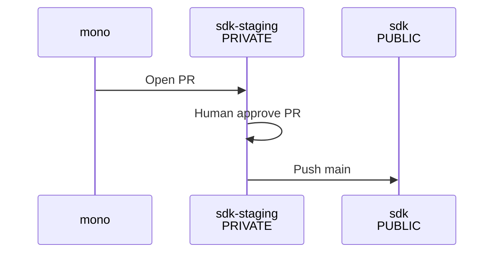

# SDK Release

Contents in this directory will be exported to the public sdk directory.

Contents are exported to [sdk-staging](https://github.com/chainguard-dev/sdk-staging) first to prevent accidentally exfiltrating mono.

## Workflow

